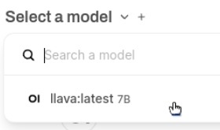

<html>
  

    <iframe style="position: absolute; top: 0; left: 0; right: 0; width: 100%; height: 100%; border: none;" src="https://www.youtube.com/embed/3MlalSPu1gI?rel=0&cc_load_policy=1" allowfullscreen allow="accelerometer; autoplay; clipboard-write; encrypted-media; gyroscope; picture-in-picture; web-share">
    </iframe>
  
  
</html>

## Αναγνώριση εικόνας με WebUI

Για να χρησιμοποιήσεις το Ollama, πρέπει να κατεβάσεις ένα μοντέλο για να το χρησιμοποιήσεις. Προηγουμένως, χρησιμοποίησες το μοντέλο μόνο για κείμενο `gemma:2b`, αλλά σε αυτό το βήμα θα χρησιμοποιήσεις το μοντέλο ανάλυσης εικόνας που ονομάζεται `LLaVa`.

\--- task ---

Για να κατεβάσεις το μοντέλο LLaVA, απόκτησε πρόσβαση στο WebUI στη διεύθυνση `http://localhost:3000`.

\--- /task ---

\--- task ---

Εγγραφή στο WebUI του Ollama.

Όταν χρησιμοποιείς το WebUI για πρώτη φορά, θα σου ζητηθεί να δώσεις ένα όνομα, ένα email και έναν κωδικό πρόσβασης. Μπορείς να χρησιμοποιήσεις ένα οποιοδήποτε email ειδικά γι' αυτό, είναι μόνο για τοπική χρήση στο Raspberry Pi σου.

\--- /task ---

\--- task ---

Επίλεξε ποιο μοντέλο θα χρησιμοποιήσεις από το αναπτυσσόμενο μενού στο επάνω μέρος του WebUI. Μπορείς επίσης να αναζητήσεις και να προσθέσεις νέα μοντέλα με αυτόν τον τρόπο — πληκτρολόγησε `llava:latest` στην αναζήτηση και επίλεξε `Pull llava:latest from Ollama.com`. Το μοντέλο σου θα ξεκινήσει να κατεβαίνει.

\--- /task ---

\--- task ---

Περίμενε να ολοκληρωθεί η λήψη του μοντέλου και να το επαληθεύσεις. Αυτό μπορεί να διαρκέσει κάποιο χρόνο.

\--- /task ---

### Χρησιμοποίησε το LLaVa για να αναλύσεις μια εικόνα

<html>
  
  

    <iframe style="position: absolute; top: 0; left: 0; right: 0; width: 100%; height: 100%; border: none;" src="https://www.youtube.com/embed/ruU6KsVyxKA?rel=0&cc_load_policy=1" allowfullscreen allow="accelerometer; autoplay; clipboard-write; encrypted-media; gyroscope; picture-in-picture; web-share">
    </iframe>
  
  
</html>

\--- task ---

Μόλις ολοκληρωθεί η λήψη του μοντέλου LLaVA, ξεκίνησε μια νέα συνεδρία συνομιλίας επιλέγοντας το μοντέλο από τις διαθέσιμες επιλογές.

\--- /task ---

\--- task ---

Ανέβασε μια εικόνα χρησιμοποιώντας το κουμπί "Upload Image".

\--- /task ---

\--- task ---

Μετά τη μεταφόρτωση, δώσε μια προτροπή ή ερώτηση σχετικά με την εικόνα στο πλαίσιο συνομιλίας. Πάτα <kbd>Enter</kbd>.

\--- /task ---

\--- task ---

Επανεξέτασε την περιγραφή ή την ανάλυση που δημιουργήθηκε από το μοντέλο LLaVA. Μπορείς να κάνεις περισσότερες ερωτήσεις ή να ανεβάσεις επιπλέον εικόνες.

Χρησιμοποιώντας αυτήν την εικόνα:
![Η εικόνα δείχνει ένα κοντινό πλάνο μιας σπιτικής κοντότριχης γάτας με εντυπωσιακά μεγάλα μάτια και μια προσεκτική έκφραση. Η γάτα έχει αφράτο γούνινο τρίχωμα, κυρίως σε αποχρώσεις κρεμ και λευκού, με πιο σκούρα σημάδια στο πρόσωπο, στα αυτιά και στα πόδια της. Φαίνεται να κάθεται ή να είναι ξαπλωμένη, με τα μπροστινά της πόδια ελαφρώς τεντωμένα προς τον θεατή. Η ουρά της γάτας είναι τυλιγμένη πάνω στο σώμα της. Πίσω από τη γάτα υπάρχει ένα μπουκέτο από άνθη λεβάντας, που προσθέτουν μια πινελιά χρώματος και υφής στην εικόνα. Στην αριστερή πλευρά της φωτογραφίας υπάρχει μια μωβ απόχρωση, που υποδηλώνει ένα μπλε τοίχο ή φόντο. Σε πρώτο πλάνο, διακρίνεται μια ξύλινη επιφάνεια, πιθανώς ένα τραπέζι ή ένας πάγκος, με μερικά βότανα τοποθετημένα σε ένα δοχείο στην επάνω δεξιά γωνία. Το συνολικό στυλ της εικόνας είναι ρεαλιστικό με έμφαση στη λεπτομέρεια και ένα μικρό βάθος πεδίου που αναδεικνύει τα χαρακτηριστικά της γάτας.](images/cat.jpg)

Το LLaVa παρείχε αυτή την περιγραφή:

`The image shows a close-up of a domestic shorthair cat with striking large eyes and an attentive expression. The cat has a fluffy fur coat, primarily in shades of cream and white, with darker markings on its face, ears, and paws. It appears to be sitting or laying down, with its front paws slightly extended towards the viewer. The cat's tail is coiled up against its body. Behind the cat is a bouquet of lavender flowers, adding a touch of color and texture to the image. On the left side of the photo, there is a purple hue, suggesting a blue wall or background. In the foreground, a wooden surface can be seen, possibly a table or a counter, with some herbs placed in a container on the top right corner. The overall style of the image is realistic with a focus on detail and a shallow depth of field that highlights the cat's features.`

\--- /task ---
