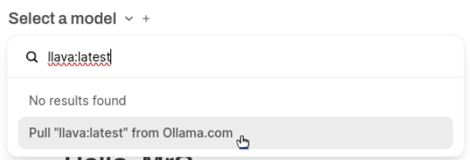

## Pull and Run a Model for Your Ollama Instance
In simple terms, "pulling a model" means downloading a specific AI model that Ollama will use to perform tasks. 

There are various models available at [ollama.com/library](https://ollama.com/library){:target="_blank"}. We recommend starting with `gemma:2b`, `phi`, or `tinyllama`. Be cautious with models larger than 5 billion parameters, as they might be too demanding for a standard Raspberry Pi.

--- task ---

Run the following command, replacing `[model name here]` with the name of the model you want to use:

```sh
ollama run [model name here]
```
You will see some progress bars fill up and then be asked to prompt the model.


--- /task ---

--- task ---

Interact with the model by asking it questions, requesting it to write a poem or story, or simply having a chat.


Press `Ctrl + D` to exit the LLM prompting process when you are done.

--- /task ---

### Using the WebUI
The WebUI works like any other chatbot interface. You can type in your prompts and see the responses generated by the model.


--- task ---

Access the WebUI interface by navigating to `http://localhost:8080/` in your web browser.


--- /task ---


--- task ---

Choose which model to use from the dropdown menu at the top of the WebUI. You can also search for and add new models this way.




--- /task ---