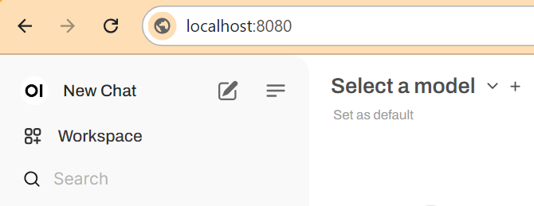

<html>
  <div style="position: relative; overflow: hidden; padding-top: 56.25%;">
    <iframe style="position: absolute; top: 0; left: 0; right: 0; width: 100%; height: 100%; border: none;" src="https://www.youtube.com/embed/xx0VQ0RJc8A?rel=0&cc_load_policy=1" allowfullscreen allow="accelerometer; autoplay; clipboard-write; encrypted-media; gyroscope; picture-in-picture; web-share">
    </iframe>
  </div>
</html>

## Using the WebUI
The WebUI works like any other chatbot interface. You can type in your prompts and see the responses generated by the model.

![A screenshot of an AI interface displaying a clean, minimalist design. The text "Hello, MrC" is prominently shown in the center. Below, there is a search bar labeled "How can I help you today?" with a microphone and audio icon to the right. Suggested prompts include "Tell me a fun fact about the Roman Empire," "Show me a code snippet of a website's sticky header," and "Give me ideas for what to do with my kids' art." On the left side, there is a menu with options for "Workspace," "Search," and "Chats." A circular profile icon labeled "M" is in the top right corner.](images/webUI.png)

### Install Docker and the WebUI

--- task ---

Install Docker by entering the following command into the terminal:

```bash
sudo apt install docker.io
```
Wait for Docker to install. You will know installation is finished when the terminal prompt returns.

--- /task ---

--- task ---

Install WebUI by copying and pasting the following command into the terminal:

```bash
sudo docker run -d -p 3000:8080 -v ollama:/root/.ollama -v open-webui:/app/backend/data --name open-webui --restart always ghcr.io/open-webui/open-webui:ollama
```
Wait for WebUI to install. You will know installation is finished when the terminal prompt returns.

--- /task ---

--- task ---

Access the WebUI interface by navigating to `http://localhost:3000/` in your web browser.



--- /task ---
