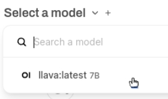

<html>
  

    <iframe style="position: absolute; top: 0; left: 0; right: 0; width: 100%; height: 100%; border: none;" src="https://www.youtube.com/embed/FDx8N_rQig8?rel=0&cc_load_policy=1" allowfullscreen allow="accelerometer; autoplay; clipboard-write; encrypted-media; gyroscope; picture-in-picture; web-share">
    </iframe>
  
  
</html>

## Image recognition with WebUI

To use Ollama, you must download a model to use. Previously, you used the text-only model `gemma:2b`, but in this step you will use the image analysis model called `LLaVa`.

--- task ---

To download the LLaVA model, access the WebUI at `http://localhost:3000`.

--- /task ---

--- task ---

Sign-up for Ollama WebUI 

When using WebUI for the first time, you will be asked to provide a name, email, and password. You can use any made-up email for this, it is only for local use on your Raspberry Pi. 

--- /task ---

--- task ---

Choose which model to use from the drop-down menu at the top of the WebUI. You can also search for and add new models this way - type `llava:latest` into the search and choose `Pull llava:latest from Ollama.com`. Your model will begin to download.

--- /task ---

--- task ---

Wait for the model to download and verify. This may take some time.

--- /task ---

### Use LLaVa to analyse an image

<html>
  
  

    <iframe style="position: absolute; top: 0; left: 0; right: 0; width: 100%; height: 100%; border: none;" src="https://www.youtube.com/embed/_krvzVdouW0?rel=0&cc_load_policy=1" allowfullscreen allow="accelerometer; autoplay; clipboard-write; encrypted-media; gyroscope; picture-in-picture; web-share">
    </iframe>
  
  
</html>

--- task ---

Once the LLaVA model is downloaded, start a new chat session by selecting the model from the available options.

--- /task ---

--- task ---

Upload an image using the "Upload Image" button. 

--- /task ---

--- task ---

After uploading, enter a prompt or question about the image in the chat box. Press <kbd>Enter<kbd>.

--- /task ---

--- task ---

Review the description or analysis generated by the LLaVA model. You can ask more questions or upload additional images.

Using this image:
![The image shows a close-up of a domestic shorthair cat with striking large eyes and an attentive expression. The cat has a fluffy fur coat, primarily in shades of cream and white, with darker markings on its face, ears, and paws. It appears to be sitting or laying down, with its front paws slightly extended towards the viewer. The cat's tail is coiled up against its body. Behind the cat is a bouquet of lavender flowers, adding a touch of color and texture to the image. On the left side of the photo, there is a purple hue, suggesting a blue wall or background. In the foreground, a wooden surface can be seen, possibly a table or a counter, with some herbs placed in a container on the top right corner. The overall style of the image is realistic with a focus on detail and a shallow depth of field that highlights the cat's features.](images/cat.jpg)

LLaVa provided this description:

`The image shows a close-up of a domestic shorthair cat with striking large eyes and an attentive expression. The cat has a fluffy fur coat, primarily in shades of cream and white, with darker markings on its face, ears, and paws. It appears to be sitting or laying down, with its front paws slightly extended towards the viewer. The cat's tail is coiled up against its body. Behind the cat is a bouquet of lavender flowers, adding a touch of color and texture to the image. On the left side of the photo, there is a purple hue, suggesting a blue wall or background. In the foreground, a wooden surface can be seen, possibly a table or a counter, with some herbs placed in a container on the top right corner. The overall style of the image is realistic with a focus on detail and a shallow depth of field that highlights the cat's features.`

--- /task ---
