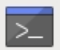

## Installer Ollama sur ton Raspberry Pi

<html>
  <div style="position: relative; overflow: hidden; padding-top: 56.25%;">
    <iframe style="position: absolute; top: 0; left: 0; right: 0; width: 100%; height: 100%; border: none;" src="https://www.youtube.com/embed/OwuPZYmbYsg?rel=0&cc_load_policy=1" allowfullscreen allow="accelerometer; autoplay; clipboard-write; encrypted-media; gyroscope; picture-in-picture; web-share">
    </iframe>
  </div>
</html>

\--- task ---

Ouvre une fenêtre de terminal sur ton Raspberry Pi

Pour commencer, tu dois accéder au terminal. Tu peux le faire en cliquant sur l'icône du terminal ou en appuyant sur `Ctrl + Alt + T`.



\--- /task ---

\--- task ---

Installe Ollama.

Utilise le script shell suivant pour installer Ollama et l'interface WebUI :

```sh
curl -fsSL https://ollama.com/install.sh | sh
```

Ce processus d'installation peut prendre un certain temps. Tu sauras que c'est terminé lorsque l'invite du terminal réapparaît.

\--- /task ---
