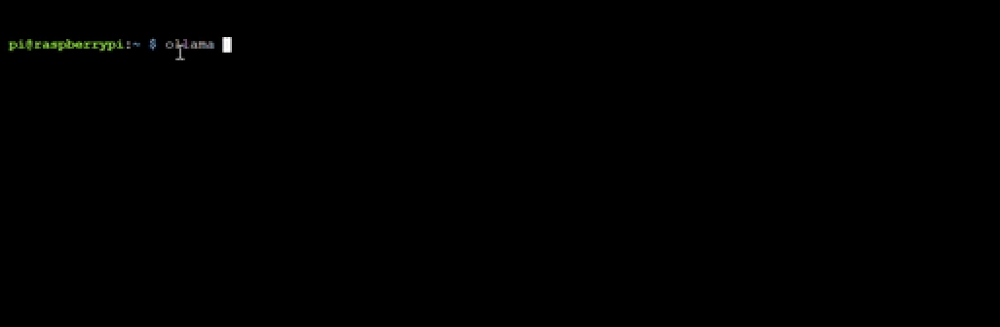

<html>
  <div style="position: relative; overflow: hidden; padding-top: 56.25%;">
    <iframe style="position: absolute; top: 0; left: 0; right: 0; width: 100%; height: 100%; border: none;" src="https://www.youtube.com/embed/LZFqptMrWPA?rel=0&cc_load_policy=1" allowfullscreen allow="accelerometer; autoplay; clipboard-write; encrypted-media; gyroscope; picture-in-picture; web-share">
    </iframe>
  </div>
</html>

## Récupérer et exécuter un modèle pour ton Ollama

En termes simples, "récupérer un modèle" signifie télécharger un modèle IA spécifique qu'Ollama utilisera pour effectuer des tâches.

<p style='border-left: solid; border-width:10px; border-color: #0faeb0; background-color: aliceblue; padding: 10px;'>
Il existe plusieurs modèles disponibles sur [ollama.com/library](https://ollama.com/library){:target="_blank"}. Nous te recommandons de commencer par `gemma:2b`, `phi`, ou `tinyllama`. Sois prudent avec les modèles comportant plus de 5 milliards de paramètres, car ils peuvent exiger une capacité trop importante de la part d'un Raspberry Pi standard.
</p>

\--- task ---

Exécute la commande suivante, en remplaçant `[model name here]` par le nom du modèle que tu souhaites utiliser :

```sh
ollama run [model name here]
```

Tu verras un certain nombre de barres de progression se remplir, puis tu seras invité à activer le modèle.



\--- /task ---

\--- task ---

Interact with the model by asking it questions, requesting it to write a poem or story, or act as a study aid:

```
>>> write a short funny poem about skibidi

Oh Skibidi, you're a sight to behold,
A sail that's made of clouds, so light and
bold.
Your laughter echoes through the air,
As you dance across the starry fair.
With a grin so wide, you fill the sky,
A twinkle that makes everyone sigh.
Skibidi, a joy we cannot deny,
A skibidi, a playful sigh.
```

Appuie sur `Ctrl + D` pour quitter le processus LLM lorsque tu as terminé.

\--- /task ---

## --- collapse ---

## title: Modèles et tailles recommandés

Il existe de nombreux modèles disponibles dans la bibliothèque Ollama, mais les modèles plus grands (modèles avec plus de paramètres) prendront plus de place sur ton disque dur, nécessiteront plus de temps de téléchargement et plus de mémoire pour s'exécuter.

Le nombre de paramètres d'un modèle peut être considéré comme la « taille » de l'ensemble de données d'apprentissage du modèle : un plus grand nombre de paramètres signifie généralement que le modèle peut trouver et représenter des modèles et des relations plus complexes dans les données.

Voici une liste de modèles, le nombre de paramètres, et la taille requise en Go sur ton disque dur :

| Nom du modèle                   | Paramètres     | Taille (Go) |
| ------------------------------- | -------------- | ------------------------------ |
| oLLama-7B                       | 7 milliards    | 13                             |
| oLLama-3B                       | 3 milliards    | 6                              |
| oLLama-1B                       | 1 milliard     | 2                              |
| oLLama-500M                     | 500 millions   | 1                              |
| oLLama-300M                     | 300 millions   | 0,6                            |
| Llama2-7B                       | 7 milliards    | 13                             |
| Llama2-13B                      | 13 milliards   | 26                             |
| Phi-3 Mini                      | 3 milliards    | 3,8                            |
| Phi-3 Medium                    | 14 milliards   | 15                             |
| Orca Mini                       | 7 milliards    | 13                             |
| Solar                           | 10,7 milliards | 6,1-21                         |
| Gemma-2B                        | 2 milliards    | 3,5                            |
| Gemma-7B                        | 7 milliards    | 11,5                           |
| LLaVA-7B                        | 7 milliards    | 5,5                            |
| LLaVA-13B                       | 13 milliards   | 17                             |
| StarCoder-7B                    | 7 milliards    | 15                             |
| CodeLlama-7B                    | 7 milliards    | 13                             |
| Dolphin-2.2-70B | 70 milliards   | 28                             |
| Magicoder-7B                    | 7 milliards    | 10,5                           |

Tu peux télécharger et exécuter n'importe lequel de ces modèles sur ton Raspberry Pi en ouvrant le terminal et en entrant :

```bash
ollama run [Model Name]
```

Par exemple, pour exécuter `gemma:2b`, tape :

```bash
ollama run gemma:2b
```

\--- /collapse ---
