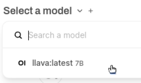

<html>
  

    <iframe style="position: absolute; top: 0; left: 0; right: 0; width: 100%; height: 100%; border: none;" src="https://www.youtube.com/embed/3MlalSPu1gI?rel=0&cc_load_policy=1" allowfullscreen allow="accelerometer; autoplay; clipboard-write; encrypted-media; gyroscope; picture-in-picture; web-share">
    </iframe>
  
  
</html>

## Riconoscimento delle immagini con WebUI

Per utilizzare Ollama, devi scaricare un modello. In precedenza hai utilizzato il modello solo testo `gemma:2b`, ma in questo passaggio utilizzerai il modello di analisi delle immagini chiamato `LLaVa`.

--- task ---

Per scaricare il modello LLaVA, accedi alla WebUI all'indirizzo `http://localhost:3000`.

--- /task ---

--- task ---

Registrati su Ollama WebUI.

Quando usi la WebUI per la prima volta, ti verrà chiesto di inserire un nome, un'email e una password.
Puoi usare un'email inventata, serve solo per l'uso locale sul tuo Raspberry Pi.

--- /task ---

--- task ---

Scegli quale modello utilizzare dal menu a discesa nella parte superiore della WebUI. Puoi anche cercare e aggiungere nuovi modelli: digita `llava:latest` nella ricerca e scegli `Pull llava:latest from Ollama.com`. Inizierà il download del tuo modello.

--- /task ---

--- task ---

Attendi che il modello venga scaricato e verificato. Questo operazione potrebbe richiedere un po' di tempo.

--- /task ---

### Usa LLaVa per analizzare un'immagine

<html>
  
  

    <iframe style="position: absolute; top: 0; left: 0; right: 0; width: 100%; height: 100%; border: none;" src="https://www.youtube.com/embed/ruU6KsVyxKA?rel=0&cc_load_policy=1" allowfullscreen allow="accelerometer; autoplay; clipboard-write; encrypted-media; gyroscope; picture-in-picture; web-share">
    </iframe>
  
  
</html>

--- task ---

Una volta scaricato il modello LLaVA, avvia una nuova sessione di chat selezionando il modello tra le opzioni disponibili.

--- /task ---

--- task ---

Carica un'immagine utilizzando il pulsante "Upload Image".

--- /task ---

--- task ---

Dopo aver caricato l’immagine, inserisci un prompt o una domanda sull’immagine nella casella di chat.Premi <kbd>Invio</kbd>.

--- /task ---

--- task ---

Leggi la descrizione o l'analisi generata dal modello LLaVA.Puoi fare altre domande o caricare nuove immagini.

Utilizzando questa immagine:
![L’immagine mostra un primo piano di un gatto domestico a pelo corto con occhi grandi e un’espressione attenta. Il gatto ha un pelo soffice, principalmente in tonalità crema e bianco, con macchie più scure su viso, orecchie e zampe. Sembra seduto o sdraiato, con le zampe anteriori leggermente distese verso l’osservatore. La coda è arrotolata contro il corpo. Dietro al gatto c’è un mazzo di fiori di lavanda, che aggiunge colore e struttura all'immagine. Sul lato sinistro della foto si nota una tonalità violacea, che suggerisce una parete o uno sfondo blu. In primo piano si vede una superficie di legno, probabilmente un tavolo o un ripiano, con alcune erbe in un contenitore nell’angolo in alto a destra. Lo stile dell’immagine è realistico, con attenzione ai dettagli e una profondità di campo ridotta che mette in risalto le caratteristiche del gatto.](images/cat.jpg)

LLaVa ha fornito questa descrizione:

`L’immagine mostra un primo piano di un gatto domestico a pelo corto con occhi sorprendentemente grandi e un’espressione attenta. Il gatto ha un pelo soffice, principalmente in tonalità crema e bianco, con macchie più scure su viso, orecchie e zampe. Sembra seduto o sdraiato, con le zampe anteriori leggermente distese verso l’osservatore. La coda è arrotolata contro il corpo. Dietro al gatto c’è un mazzo di fiori di lavanda, che aggiunge colore e struttura all'immagine. Sul lato sinistro della foto si nota una tonalità violacea, che suggerisce una parete o uno sfondo blu. In primo piano si vede una superficie di legno, probabilmente un tavolo o un ripiano, con alcune erbe in un contenitore nell’angolo in alto a destra. Lo stile dell’immagine è realistico, con attenzione ai dettagli e una profondità di campo ridotta che mette in risalto le caratteristiche del gatto.`

--- /task ---
