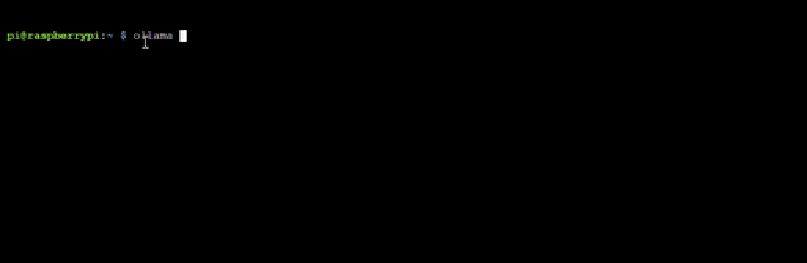

<html>
  <div style="position: relative; overflow: hidden; padding-top: 56.25%;">
    <iframe style="position: absolute; top: 0; left: 0; right: 0; width: 100%; height: 100%; border: none;" src="https://www.youtube.com/embed/LZFqptMrWPA?rel=0&cc_load_policy=1" allowfullscreen allow="accelerometer; autoplay; clipboard-write; encrypted-media; gyroscope; picture-in-picture; web-share">
    </iframe>
  </div>
</html>

## Ollama用のモデルを取得し実行する

「モデルを取得する」とは、簡単に言うとOllamaがタスクを実行するために使用する特定のAIモデルをダウンロードすることを意味します。

<p style='border-left: solid; border-width:10px; border-color: #0faeb0; background-color: aliceblue; padding: 10px;'>
[ollama.com/library](https://ollama.com/library){:target="_blank"}にはさまざまなモデルがあります。 `gemma:2b`、`phi`、または`tinyllama`から始めることをお勧めします。 パラメータ数が50億を超えるモデルは、標準的なRaspberry Piだと負荷が高くなりすぎるかもしれないので注意が必要です。
</p>

\--- task ---

以下のコマンドの`[モデル名]`の部分を、使用したいモデル名に置き換えて実行してください。

```sh
ollama run [モデル名]
```

進行状況を示すバーが進んでいくと、モデルに指示を与えるように求められます。



\--- /task ---

\--- task ---

モデルに質問したり、詩や物語を書くように依頼したり、学習補助ツールとして活用したりして、モデルと対話してみましょう。

```
>>> スキビディについて短くて面白い詩を書いてください

ああスキビディ、その姿は目を奪う、
雲で編まれた帆のように、軽やかで
大胆に。
君の笑い声が空気に響き渡る、
星降る祭りの場を、君は舞い踊る。
その満面の笑みで空を満たし、
みんなの心をため息でそめる輝き。
スキビディ、否定できない喜びよ、
スキビディ、遊び心あふれるため息よ。
```

完了したら、`Ctrl + D`を押してLLMのプロンプトプロセスを終了してください。

\--- /task ---

## --- collapse ---

## title: おすすめのモデルとサイズ

Ollamaライブラリにはたくさんのモデルが用意されていますが、大きなモデル（パラメータ数の多いモデル）はハードディスクの容量をより多く消費し、ダウンロードにより多くの時間がかかり、実行にはより多くのメモリが必要になります。

モデルのパラメータ数は、モデルの学習データセットの「規模」と考えることができます。パラメータが多いほど、一般的にモデルはデータの中からより複雑なパターンや関係性を見つけ出し、表現できるようになります。

以下は、モデルの一覧、パラメータ数、およびハードディスク上に必要なサイズ(GB)の表です。

| モデル名                            | パラメータ数 | サイズ(GB) |
| ------------------------------- | ------ | -------------------------- |
| oLLama-7B                       | 70億    | 13                         |
| oLLama-3B                       | 30億    | 6                          |
| oLLama-1B                       | 10億    | 2                          |
| oLLama-500M                     | 5億     | 1                          |
| oLLama-300M                     | 3億     | 0.6        |
| Llama2-7B                       | 70億    | 13                         |
| Llama2-13B                      | 130億   | 26                         |
| Phi-3 Mini                      | 30億    | 3.8        |
| Phi-3 Medium                    | 140億   | 15                         |
| Orca Mini                       | 70億    | 13                         |
| Solar                           | 107億   | 6.1-21     |
| Gemma-2B                        | 20億    | 3.5        |
| Gemma-7B                        | 70億    | 11.5       |
| LLaVA-7B                        | 70億    | 5.5        |
| LLaVA-13B                       | 130億   | 17                         |
| StarCoder-7B                    | 70億    | 15                         |
| CodeLlama-7B                    | 70億    | 13                         |
| Dolphin-2.2-70B | 700億   | 28                         |
| Magicoder-7B                    | 70億    | 10.5       |

これらのモデルはいずれも、ターミナルを開いて以下のコマンドを入力することで、Raspberry Piにダウンロードして実行することができます。

```bash
ollama run [モデル名]
```

例えば、`gemma:2b`を実行するには、次のように入力します。

```bash
ollama run gemma:2b
```

\--- /collapse ---
