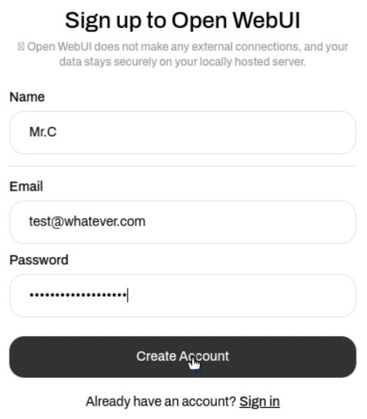
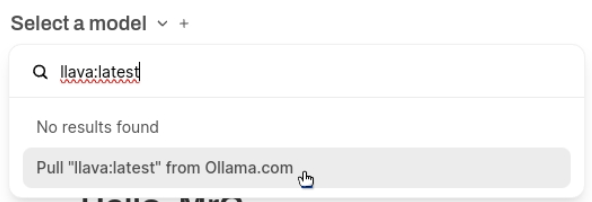
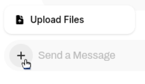

<html>
  

    <iframe style="position: absolute; top: 0; left: 0; right: 0; width: 100%; height: 100%; border: none;" src="https://www.youtube.com/embed/3MlalSPu1gI?rel=0&cc_load_policy=1" allowfullscreen allow="accelerometer; autoplay; clipboard-write; encrypted-media; gyroscope; picture-in-picture; web-share">
    </iframe>
  
  
</html>

## WebUIによる画像認識

Ollamaを使用するには、使用するモデルをダウンロードする必要があります。 前のステップではテキストのみのモデル`gemma:2b`を使用しましたが、このステップでは`LLaVa`と呼ばれる画像解析モデルを使用します。

\--- task ---

LLaVAモデルをダウンロードするには、`http://localhost:3000`のWebUIにアクセスしてください。

\--- /task ---

\--- task ---

Orlama WebUIにサインアップします。

初めてWebUIを使用する場合は、名前、メールアドレス、パスワードを入力するよう求められます。 この用途には任意の架空のメールアドレスを使用できます。これはRaspberry Pi上でのローカル使用のみを目的としています。

\--- /task ---

\--- task ---

WebUI上部のドロップダウンメニューから使用するモデルを選択します。 新しいモデルを検索して追加するには次の方法もあります。検索ボックスに「llava:latest」と入力し、「Ollama.comからllava:latestを取得する」を選択します。 モデルのダウンロードが開始されます。

\--- /task ---

\--- task ---

モデルのダウンロードと検証が完了するまでお待ちください。 しばらく時間がかかることがあります。

\--- /task ---

### LLaVaを使用して画像を分析する

<html>
  
  

    <iframe style="position: absolute; top: 0; left: 0; right: 0; width: 100%; height: 100%; border: none;" src="https://www.youtube.com/embed/ruU6KsVyxKA?rel=0&cc_load_policy=1" allowfullscreen allow="accelerometer; autoplay; clipboard-write; encrypted-media; gyroscope; picture-in-picture; web-share">
    </iframe>
  
  
</html>

\--- task ---

LLaVAモデルをダウンロードしたら、利用可能なオプションからモデルを選択して、新しいチャットセッションを開始します。

\--- /task ---

\--- task ---

「画像をアップロード」ボタンを使用して画像をアップロードします。

\--- /task ---

\--- task ---

アップロード後、チャットボックスに画像に関するプロンプトや質問を入力します。 <kbd>Enter</kbd>を押します。

\--- /task ---

\--- task ---

LLaVAモデルによって生成された説明や解析結果を確認します。 さらに質問したり、追加の画像をアップロードしたりすることもできます。

この画像を使用します:

LLaVaはこの説明を提供しました。

`この画像は、印象的な大きな目と注意深く観察している表情をした短毛種の飼い猫のクローズアップを示している。 猫は主にクリームと白の色合いのふわふわした毛皮をまとっていて、顔や耳、足には濃い色の模様がある。 座っているか伏せているようで、前足は見る人の方に少し伸ばされている。 猫の尻尾は体にぴったりと巻き付いている。 猫の後ろにはラベンダーの花束があり、画像に彩りと質感を与えている。 写真の左側には紫がかった色合いがあり、青い壁や背景を示唆している。 手前には、おそらくテーブルかカウンターのような木製の表面が見え、右上隅には容器に入ったハーブがいくつか置かれている。 画像全体のスタイルは写実的で、細部に重点が置かれ、被写界深度が浅いため、猫の特徴が際立っている。`

\--- /task ---
