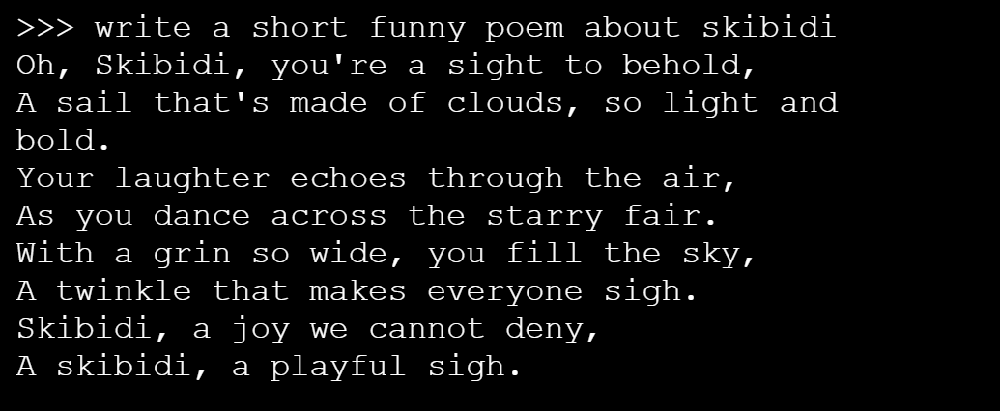

<html>
  <div style="position: relative; overflow: hidden; padding-top: 56.25%;">
    <iframe style="position: absolute; top: 0; left: 0; right: 0; width: 100%; height: 100%; border: none;" src="https://www.youtube.com/embed/LZFqptMrWPA?rel=0&cc_load_policy=1" allowfullscreen allow="accelerometer; autoplay; clipboard-write; encrypted-media; gyroscope; picture-in-picture; web-share">
    </iframe>
  </div>
</html>

## Haal een model op voor je Ollama en voer het uit

Simpel gezegd betekent 'een model ophalen' dat je een specifiek AI-model downloadt dat Ollama gebruikt om taken uit te voeren.

<p style='border-left: solid; border-width:10px; border-color: #0faeb0; background-color: aliceblue; padding: 10px;'>
Er zijn verschillende modellen beschikbaar op [ollama.com/library](https://ollama.com/library){:target="_blank"}. We raden aan om te beginnen met `gemma:2b`, `phi`, of `tinyllama`. Wees voorzichtig met modellen met meer dan 5 miljard parameters, omdat ze misschien te veel capaciteit vragen van een standaard Raspberry Pi.
</p>

\--- task ---

Voer de volgende opdracht uit en vervang `[model name here]` door de naam van het model dat je wilt gebruiken:

```sh
ollama run [model name here]
```

Je ziet dat er een aantal voortgangsbalken worden gevuld en vervolgens word je gevraagd om het model te activeren.


\--- /task ---

\--- task ---

Communiceer met het model door het vragen te stellen, het te vragen een gedicht of verhaal te schrijven of door het te gebruiken als studiehulpmiddel.



Druk op `Ctrl + D` om het LLM proces af te sluiten wanneer je klaar bent.

\--- /task ---

## --- collapse ---

## title: Aanbevolen modellen en groottes

Er zijn veel modellen beschikbaar in de Ollama-bibliotheek, maar grotere modellen (modellen met meer parameters) nemen meer ruimte in beslag op jouw harde schijf, novendien duurt het langer om ze te downloaden en is er meer geheugen nodig om ze uit te voeren.

Het aantal parameters van een model kan worden beschouwd als de 'grootte' van de trainingsdataset van het model: meer parameters betekenen over het algemeen dat het model complexere patronen en relaties in de data kan vinden en weergeven.

Hier is een lijst met modellen, het aantal parameters en hun vereiste grootte in GB op je harde schijf:

| Modelnaam                       | Parameters                   | Grootte (GB) |
| ------------------------------- | ---------------------------- | ------------------------------- |
| oLLama-7B                       | 7 miljard                    | 13                              |
| oLLama-3B                       | 3 miljard                    | 6                               |
| oLLama-1B                       | 1 miljard                    | 2                               |
| oLLama-500M                     | 500 miljoen                  | 1                               |
| oLLama-300M                     | 300 miljoen                  | 0.6             |
| Llama2-7B                       | 7 miljard                    | 13                              |
| Llama2-13B                      | 13 miljard                   | 26                              |
| Phi-3 Mini                      | 3 miljard                    | 3.8             |
| Phi-3 Medium                    | 14 miljard                   | 15                              |
| Orca Mini                       | 7 miljard                    | 13                              |
| Solar                           | 10.7 miljard | 6.1-21          |
| Gemma-2B                        | 2 miljard                    | 3.5             |
| Gemma-7B                        | 7 miljard                    | 11.5            |
| LLaVA-7B                        | 7 miljard                    | 5.5             |
| LLaVA-13B                       | 13 miljard                   | 17                              |
| StarCoder-7B                    | 7 miljard                    | 15                              |
| CodeLlama-7B                    | 7 miljard                    | 13                              |
| Dolphin-2.2-70B | 70 miljard                   | 28                              |
| Magicoder-7B                    | 7 miljard                    | 10.5            |

Je kunt elk van deze modellen downloaden en uitvoeren op jouw Raspberry Pi door de terminal te openen en het volgende in te voeren:

```bash
ollama run [Modelnaam]
```

Om bijvoorbeeld `gemma:2b` uit te voeren, typ je:

```bash
ollama run gemma:2b
```

\--- /collapse ---
