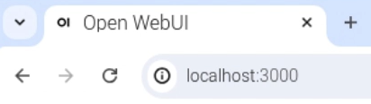

<html>
  <div style="position: relative; overflow: hidden; padding-top: 56.25%;">
    <iframe style="position: absolute; top: 0; left: 0; right: 0; width: 100%; height: 100%; border: none;" src="https://www.youtube.com/embed/xx0VQ0RJc8A?rel=0&cc_load_policy=1" allowfullscreen allow="accelerometer; autoplay; clipboard-write; encrypted-media; gyroscope; picture-in-picture; web-share">
    </iframe>
  </div>
</html>

## De WebUI gebruiken

De WebUI werkt net als elke andere chatbotinterface. Je kunt je prompts ingeven en de reacties bekijken die zijn gegenereerd door het model.

![Een screenshot van een AI-interface met een strak, minimalistisch ontwerp. De tekst "Hello, MrC" staat prominent in het midden. Daaronder vind je een zoekbalk met de tekst 'How can I help you today?', met rechts een microfoon- en audiopictogram. Mogelijke opdrachten zijn onder meer "Vertel me een leuk feit over het Romeinse Rijk, "Toon me een stukje code van een website sticky header," en "Geef me ideeën voor wat ik met de kunst van mijn kinderen moet doen." Aan de linkerkant is er een menu met opties voor "Workspace," "Search," en "Chats." Een rond profielpictogram met het label "M" bevindt zich in de rechterbovenhoek.](images/webUI.png)

### Installeer Docker en de WebUI

\--- task ---

Installeer Docker door het volgende commando in te voeren in de terminal:

```bash
sudo apt install docker.io
```

Wacht tot Docker is geïnstalleerd. Je weet dat de installatie is voltooid wanneer de terminalprompt opnieuw verschijnt.

\--- /task ---

\--- task ---

Installeer WebUI door de volgende opdracht te kopiëren en te plakken in de terminal:

```bash
sudo docker run -d -p 3000:8080 -v ollama:/root/.ollama -v open-webui:/app/backend/data --name open-webui --restart always ghcr.io/open-webui/open-webui:ollama
```

Wacht tot WebUI is geïnstalleerd. Je weet dat de installatie is voltooid wanneer de terminalprompt opnieuw verschijnt.

\--- /task ---

\--- task ---

Ga naar de WebUI interface door te navigeren naar 'http://localhost:3000/' in je webbrowser.



\--- /task ---
