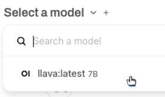

<html>
  

    <iframe style="position: absolute; top: 0; left: 0; right: 0; width: 100%; height: 100%; border: none;" src="https://www.youtube.com/embed/3MlalSPu1gI?rel=0&cc_load_policy=1" allowfullscreen allow="accelerometer; autoplay; clipboard-write; encrypted-media; gyroscope; picture-in-picture; web-share">
    </iframe>
  
  
</html>

## Beeldherkenning met WebUI

Om Ollama te kunnen gebruiken, moet je eerst een model downloaden. Eerder gebruikte je het tekstmodel `gemma:2b`, maar in deze stap gebruik je het beeld analyse-model genaamd `LLaVa`.

\--- task ---

Om het LLaVA-model te downloaden, ga je naar de WebUI via `http://localhost:3000`.

\--- /task ---

\--- task ---

Aanmelden bij Ollama WebUI.

Wanneer je WebUI voor de eerste keer gebruikt, word je gevraagd een naam, e-mailadres en wachtwoord op te geven. Je kunt hiervoor elk verzonnen e-mailadres gebruiken, maar dit is alleen bedoeld voor lokaal gebruik op jouw Raspberry Pi.

\--- /task ---

\--- task ---

Kies welk model gebruikt moet worden vanuit het dropdownmenu bovenaan de WebUI. Je kunt ook op deze manier nieuwe modellen zoeken en toevoegen - typ `llava:latest` in de search functie en kies `Pull llava:latest from Ollama.com`. Je model zal worden gedownload.

\--- /task ---

\--- task ---

Wacht tot het model is gedownload en geverifieerd. Dit kan enige tijd duren.

\--- /task ---

### Gebruik LLaVa om een afbeelding te analyseren

<html>
  
  

    <iframe style="position: absolute; top: 0; left: 0; right: 0; width: 100%; height: 100%; border: none;" src="https://www.youtube.com/embed/ruU6KsVyxKA?rel=0&cc_load_policy=1" allowfullscreen allow="accelerometer; autoplay; clipboard-write; encrypted-media; gyroscope; picture-in-picture; web-share">
    </iframe>
  
  
</html>

\--- task ---

Zodra het LLaVA-model is gedownload, start je een nieuwe chatsessie door het model te selecteren uit de beschikbare opties.

\--- /task ---

\--- task ---

Upload een afbeelding met de knop "Upload image".

\--- /task ---

\--- task ---

Nadat de afbeelding is geüpload, kun je in het chatvak een vraag over de afbeelding stellen. Druk op <kbd>Enter</kbd>.

\--- /task ---

\--- task ---

Controleer de beschrijving of analyse die door het LLaVA-model is gegenereerd. Je kunt meer vragen stellen of extra afbeeldingen uploaden.

Met behulp van deze afbeelding:
![De afbeelding toont een close-up van een huiskat met kort haar, opvallend grote ogen en een aandachtige uitdrukking. De kat heeft een donzige vacht, voornamelijk in de kleuren crème en wit, met donkere vlekken op het gezicht, de oren en de poten. Het lijkt alsof het dier zit of ligt, met de voorpoten lichtjes uitgestrekt naar de toeschouwer. De staart van de kat ligt opgekruld tegen zijn lichaam aan. Achter de kat staat een boeket lavendelbloemen, wat een vleugje kleur en textuur aan de afbeelding toevoegt. Aan de linkerkant van de foto is een paarse gloed te zien, wat doet denken aan een blauwe muur of achtergrond. Op de voorgrond is een houten oppervlak te zien, mogelijk een tafel of een aanrecht, met in de rechterbovenhoek een bakje met kruiden. De algehele stijl van de afbeelding is realistisch, met de nadruk op details en een geringe scherptediepte die de kenmerken van de kat benadrukt.](images/cat.jpg)

LLaVa heeft deze beschrijving gegeven:

\`De afbeelding toont een close-up van een huiskat met kort haar, opvallend grote ogen en een aandachtige uitdrukking. De kat heeft een donzige vacht, voornamelijk in de kleuren crème en wit, met donkere vlekken op het gezicht, de oren en de poten. Het lijkt alsof het dier zit of ligt, met de voorpoten lichtjes uitgestrekt naar de toeschouwer. De staart van de kat ligt opgekruld tegen zijn lichaam aan. Achter de kat staat een boeket lavendelbloemen, wat een vleugje kleur en textuur aan de afbeelding toevoegt. Aan de linkerkant van de foto is een paarse gloed te zien, wat doet denken aan een blauwe muur of achtergrond. Op de voorgrond is een houten oppervlak te zien, mogelijk een tafel of een aanrecht, met in de rechterbovenhoek een bakje met kruiden. De algehele stijl van de afbeelding is realistisch, met de nadruk op details en een geringe scherptediepte die de kenmerken van de kat benadrukt.]

\--- /task ---
