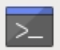

## Instale o Ollama no seu Raspberry Pi

<html>
  <div style="position: relative; overflow: hidden; padding-top: 56.25%;">
    <iframe style="position: absolute; top: 0; left: 0; right: 0; width: 100%; height: 100%; border: none;" src="https://www.youtube.com/embed/OwuPZYmbYsg?rel=0&cc_load_policy=1" allowfullscreen allow="accelerometer; autoplay; clipboard-write; encrypted-media; gyroscope; picture-in-picture; web-share">
    </iframe>
  </div>
</html>

\--- task ---

Abra uma janela do terminal no seu Raspberry Pi.

Para começar, você precisa acessar o terminal. Você pode fazer isso clicando no ícone do terminal ou pressionando `Ctrl + Alt + T`.



\--- /task ---

\--- task ---

Instale o Ollama.

Use o seguinte script shell para instalar o Ollama e a interface da WebUI:

```sh
curl -fsSL https://ollama.com/install.sh | sh
```

Este processo de instalação pode levar algum tempo. Você vai saber que está completo quando o terminal reaparecer.

\--- /task ---
