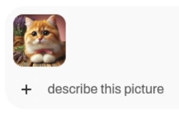

<html>
  

    <iframe style="position: absolute; top: 0; left: 0; right: 0; width: 100%; height: 100%; border: none;" src="https://www.youtube.com/embed/3MlalSPu1gI?rel=0&cc_load_policy=1" allowfullscreen allow="accelerometer; autoplay; clipboard-write; encrypted-media; gyroscope; picture-in-picture; web-share">
    </iframe>
  
  
</html>

## Reconhecimento de imagem com WebUI

Para usar o Ollama, você deve baixar um modelo para usar. Anteriormente, você usou o modelo apenas de texto `gema:2b`, mas nesta etapa você usará o modelo de análise de imagem chamado `LLaVa`.

\--- task ---

Para baixar o modelo LLaVA, acesse a interface web em `http://localhost:3000`.

\--- /task ---

\--- task ---

Cadastre-se no Ollama WebUI.

Ao usar WebUI pela primeira vez, você será solicitado a fornecer um nome, e-mail e senha. Você pode usar qualquer endereço de e-mail fictício para isso; é apenas para uso local no seu Raspberry Pi.

\--- /task ---

\--- task ---

Escolha qual modelo usar no menu colapsante na parte superior da interface do site. Você também pode pesquisar e adicionar novos modelos desta forma — digite `llava:latest` na pesquisa e escolha `Obter llava:latest de Ollama.com`. Seu modelo começará a ser baixado.

\--- /task ---

\--- task ---

Espere o modelo instalar e verifique. Isto pode demorar um pouco.

\--- /task ---

### Use LLaVa para analisar uma imagem

<html>
  
  

    <iframe style="position: absolute; top: 0; left: 0; right: 0; width: 100%; height: 100%; border: none;" src="https://www.youtube.com/embed/ruU6KsVyxKA?rel=0&cc_load_policy=1" allowfullscreen allow="accelerometer; autoplay; clipboard-write; encrypted-media; gyroscope; picture-in-picture; web-share">
    </iframe>
  
  
</html>

\--- task ---

Assim que o modelo LLaVA for baixado, inicie uma nova sessão selecionando o modelo entre as opções disponíveis.

\--- /task ---

\--- task ---

Envie uma imagem usando o botão "Enviar Imagem".

\--- /task ---

\--- task ---

Após o envio, insira um prompt ou pergunta sobre a imagem na caixa de bate-papo. Pressione <kbd>Enter</kbd>.

\--- /task ---

\--- task ---

Revise a descrição ou análise gerada pelo modelo LLaVA. Você pode fazer mais perguntas ou fazer o envio de imagens adicionais.

Usando esta imagem:
![A imagem mostra um close-up de um gato doméstico de pelo curto com olhos grandes e marcantes e uma expressão atenta. O gato tem uma pelagem macia, predominantemente em tons de creme e branco, com manchas mais escuras no rosto, orelhas e patas. Parece estar sentado ou deitado, com as patas da frente ligeiramente estendidas em direção ao espectador. O rabo do gato está enrolado junto ao corpo. Atrás do gato, há um buquê de flores de lavanda, que adiciona um toque de cor e textura à imagem. No lado esquerdo da foto, há um tom roxo, sugerindo uma parede ou fundo azul. Em primeiro plano, pode-se ver uma superfície de madeira, possivelmente uma mesa ou um balcão, com algumas ervas colocadas em um recipiente no canto superior direito. O estilo geral da imagem é realista, com foco nos detalhes e uma profundidade de campo rasa que destaca as características do gato.](images/cat.jpg)

LLaVa forneceu esta descrição:

`A imagem mostra um close-up de um gato doméstico de pelo curto com olhos grandes e marcantes e uma expressão atenta. O gato tem uma pelagem macia, predominantemente em tons de creme e branco, com manchas mais escuras no rosto, orelhas e patas. Parece estar sentado ou deitado, com as patas da frente ligeiramente estendidas em direção ao espectador. O rabo do gato está enrolado junto ao corpo. Atrás do gato, há um buquê de flores de lavanda, que adiciona um toque de cor e textura à imagem. No lado esquerdo da foto, há um tom roxo, sugerindo uma parede ou fundo azul. Em primeiro plano, pode-se ver uma superfície de madeira, possivelmente uma mesa ou um balcão, com algumas ervas colocadas em um recipiente no canto superior direito. O estilo geral da imagem é realista, com foco nos detalhes e uma profundidade de campo rasa que destaca as características do gato.`

\--- /task ---
