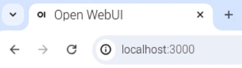

<iframe width="560" height="315" src="https://www.youtube.com/embed/xx0VQ0RJc8A?si=MeRR763nVpucx5d8" title="YouTube video player" frameborder="0" allow="accelerometer; autoplay; clipboard-write; encrypted-media; gyroscope; picture-in-picture; web-share" referrerpolicy="strict-origin-when-cross-origin" allowfullscreen></iframe>

## Використання WebUI

WebUI (вимовляється «вебʼюай) працює як будь-який інший інтерфейс чат-бота. Ти можеш вводити запити та переглядати відповіді, створені моделлю.

![Знімок екрана інтерфейсу ШІ з чітким мінімалістичним дизайном. У центрі чітко видно текст «Привіт, MrC» англійською мовою. Нижче видно рядок пошуку з підписом «Чим я можу допомогти?», а також значки мікрофона та звуку праворуч. Нижче запропоновані запити: «Розкажи мені цікавий факт про Римську імперію», «Покажи мені фрагмент коду для заголовка вебсайту» та «Дай мені ідеї, що робити з малюнками моїх дітей». Ліворуч є меню з параметрами «Робоча область», «Пошук» і «Чати». У верхньому правому куті розміщений круглий значок профілю з підписом «M».](images/webUI.png)

### Встанови Docker і WebUI

\--- task ---

Встанови Docker, ввівши таку команду в термінал:

```bash
sudo apt install docker.io
```

Дочекайся встановлення Docker. Коли підказка терміналу знову зʼявиться, це означатиме, що встановлення завершилося.

\--- /task ---

\--- task ---

Встанови WebUI: скопіюй і встав ось цю команду в термінал:

```bash
sudo docker run -d -p 3000:8080 -v ollama:/root/.ollama -v open-webui:/app/backend/data --name open-webui --restart always ghcr.io/open-webui/open-webui:ollama
```

Дочекайся встановлення WebUI. Коли підказка терміналу знову зʼявиться, це означатиме, що встановлення завершилося.

\--- /task ---

\--- task ---

Зайди в інтерфейс WebUI, перейшовши у браузері на `http://localhost:3000/`.



\--- /task ---
