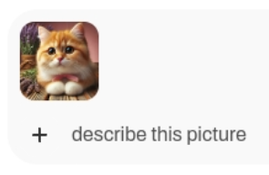

<html>
  

    <iframe style="position: absolute; top: 0; left: 0; right: 0; width: 100%; height: 100%; border: none;" src="https://www.youtube.com/embed/3MlalSPu1gI?rel=0&cc_load_policy=1" allowfullscreen allow="accelerometer; autoplay; clipboard-write; encrypted-media; gyroscope; picture-in-picture; web-share">
    </iframe>
  
  
</html>

## Розпізнавання зображень з WebUI

Щоб використовувати Ollama, ти маєш завантажити якусь модель. У попередніх кроках ми використовували лише текстову модель `gemma:2b`, але зараз ти будеш використовувати модель аналізу зображень під назвою `LLaVa`.

--- task ---

Щоб завантажити модель LLaVA, зайди у WebUI за адресою `http://localhost:3000`.

--- /task ---

--- task ---

Зареєструйтеся в Ollama WebUI.

Під час першого використання WebUI тебе попросять ввести ім’я, електронну адресу та пароль. Ти можеш використати для цього будь-яку несправжню електронну пошту, вона призначена лише для локального використання на твоєму Raspberry Pi.

--- /task ---

--- task ---

У спадному меню у верхній частині WebUI вибери модель, яку ти будеш використовувати. Ти також можеш шукати та додавати нові моделі таким чином: введи `llava:latest` у пошук і вибери `Pull llava:latest from Ollama.com` (з англійської «завантажити останню модель з Ollama.com»). Вибрана модель почне завантажуватися.

--- /task ---

--- task ---

Дочекайся завантаження моделі та перевір її. Це може тривати певний час.

--- /task ---

### Використовуй LLaVa для аналізу зображення

<html>
  
  

    <iframe style="position: absolute; top: 0; left: 0; right: 0; width: 100%; height: 100%; border: none;" src="https://www.youtube.com/embed/ruU6KsVyxKA?rel=0&cc_load_policy=1" allowfullscreen allow="accelerometer; autoplay; clipboard-write; encrypted-media; gyroscope; picture-in-picture; web-share">
    </iframe>
  
  
</html>

--- task ---

Після завантаження моделі LLaVA почни новий сеанс чату, вибравши модель із доступних варіантів.

--- /task ---

--- task ---

Завантаж зображення за допомогою кнопки Upload Image («Завантажити зображення»).

--- /task ---

--- task ---

Після завантаження введи запит або питання щодо зображення у вікні чату. Натисни <kbd>Enter</kbd>.

--- /task ---

--- task ---

Переглянь опис або аналіз, згенерований моделлю LLaVA. Ти можеш поставити додаткові запитання або завантажити додаткові зображення.

Використовуючи це зображення:
![На зображенні великим планом показано домашнього короткошерстого кота з незвично великими очима та уважним виразом обличчя. Кіт має пухнасту шерстку, переважно кремового та білого відтінків, з темнішими плямами на морді, вухах і лапах. Він сидить або лежить, передні лапи злегка витягнуті до глядача. Хвіст кота згорнутий навколо тіла. Позаду кота – букет квітів лаванди, що додає зображенню кольору та атмосфери. Ліва частина зображення має фіолетовий відтінок, що свідчить про блакитну стіну або фон. На передньому плані бачимо дерев’яну поверхню, можливо, стіл або поличку, у верхньому правому кутку якого розміщені трави у контейнері. Загальний стиль зображення реалістичний із акцентом на деталях і малою глибиною різкості, що підкреслює риси кота.](images/cat.jpg)

LLaVa надала цей опис (перекладено з англійської):

`На зображенні великим планом показано домашнього короткошерстого кота з незвично великими очима та уважним виразом обличчя. Кіт має пухнасту шерстку, переважно кремового та білого відтінків, з темнішими плямами на морді, вухах і лапах. Він сидить або лежить, передні лапи злегка витягнуті до глядача. Хвіст кота згорнутий навколо тіла. Позаду кота – букет квітів лаванди, що додає зображенню кольору та атмосфери. Ліва частина зображення має фіолетовий відтінок, що свідчить про блакитну стіну або фон. На передньому плані бачимо дерев’яну поверхню, можливо, стіл або поличку, у верхньому правому кутку якого розміщені трави у контейнері. Загальний стиль зображення реалістичний із акцентом на деталях і малою глибиною різкості, що підкреслює риси кота.`

--- /task ---
